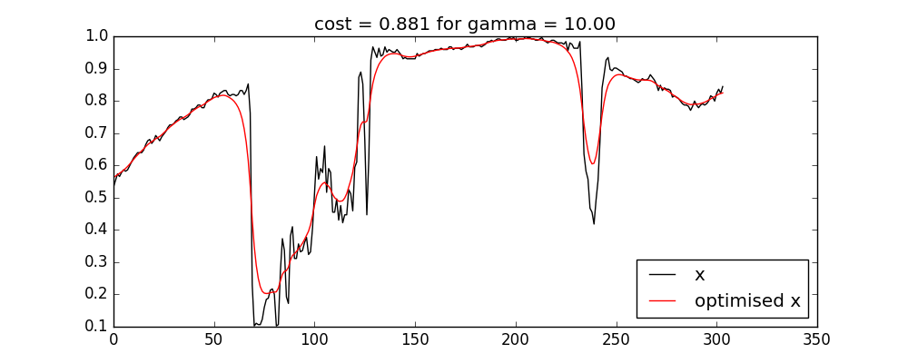
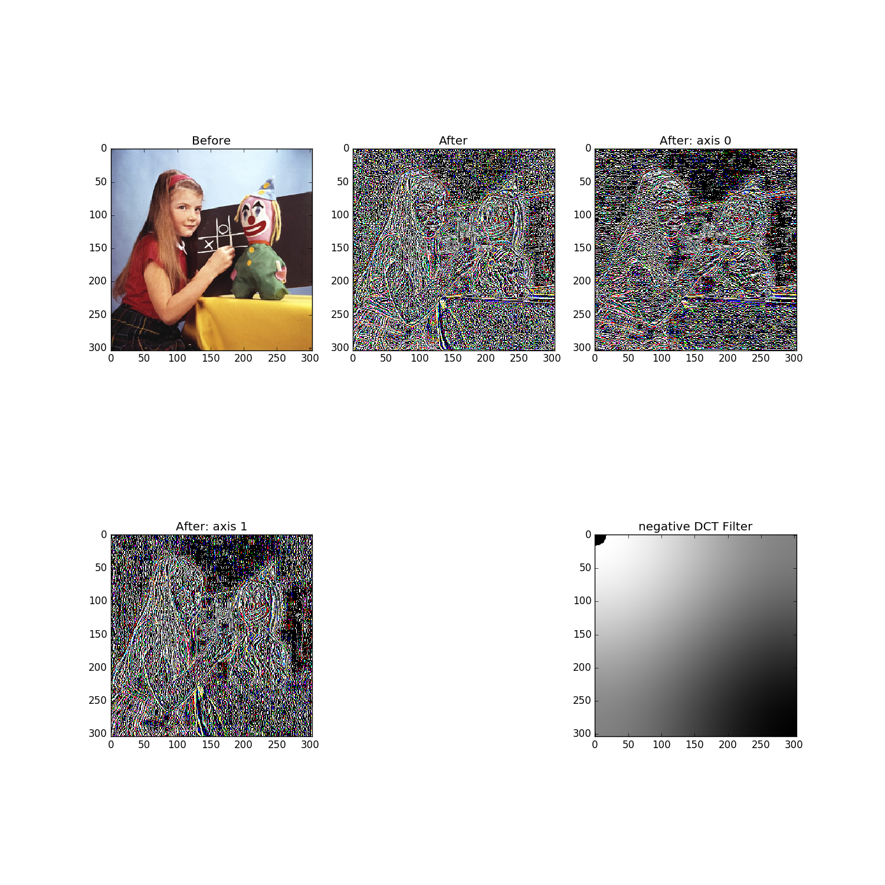
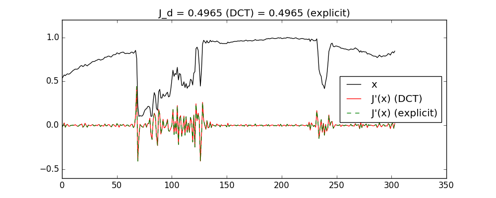

# fastDiff
fast (DCT-based) differential

Examples:
  case 5: use the class in an optimisation.
  
  This involves:
  
  1. Define some utilities:
  
      def cost_identity(x,xobs):
        J_ = x - xobs
        J =  0.5 * np.dot(J_,J_)
        return J,J_

  
 2. main code
  
      from PIL import Image
      import urllib2
      from fastDiff import fastDiff
      import pylab as plt
      
      # pull a dataset and make it 1D for now
      url='https://upload.wikimedia.org/wikipedia/en/0/04/TCF_centre.jpg'
      im = np.array(Image.open(urllib2.urlopen(url)).convert("L")).astype(float)[50]
      x = im/im.max()
      
      

    
  
  

 case 1: show impulse response function
 

 case 2: greyscale image differentiation in one or more dimensions
 

 case 3: colour image differentiation in one or more dimensions
 

 case 4: use to get J and J' for differential operator
 

